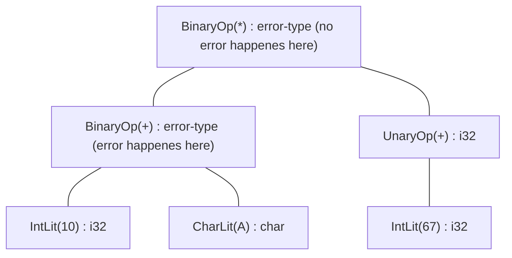

# Semantic Analysis


## Overview
The `semantic` namespace provides different tools to ensure a program is semantically correct. In order to do so we have a two pass pipeline: 

The `ExplorationPass` implements the interface of a `Visitor` over an Abstract Syntax Tree and first collect all namespace level declarations, these will be stored inside a `Namespace` object. Elements of the `Namespace` are hoisted, meaning you can use them before they were actually declared in the lexicographic sense.

The `TypeCheckingPass` also implements a `Visitor` over an AST. Its Job is to make sure, all types in the AST are filled in and make semantic sense. For example adding a number and a string does not really have a clear definition and should be illegal. Adding two floats has a clear meaning and is allowed.

All passes share a mutable reference to a `TypeCheckerContext` object. This context is used as a container for shared information between passes like all accumulated error messages that happened until now. It also owns a global Namespace that will be filled by the `ExplorationPass`.


## Exploration Pass

### Builtin Operators
The `Operator` file provides a way of adding all default operations to a `Namespace` object. This will make all the default operators like adding two integers or two strings legal. This is done by treating most operators as basic functions while type checking. This reduces repeated logic for all operators while still being very expandable especially if operator overloading is ever added. Lets look at an example `BinaryExpr(IntLit(1), +, IntLit(5))` describes a basic addition of two signed integers. Internally the type checker will see this binary expression and try to look for an operator. Because we dont support operator overloading, the type checker looks for a function with the name `operator<i32,i32>+`. If the function is found and matches the input arguments, its return type can be used as the return type for the binary expression. There are some exceptions, all `Assignment` operations are treated differently and also the `Dereference` unary operation is (for now) implemented with a different logic. All other operators use this function-like approach.

### Exploration
While exploring we just loop through all declarations inside a `Module`. As of right now, there can only be `FuncDecl`s inside a `Module`. We can just add each one to the global `Namespace`, storing the function name and the `FunctionType`, that means information like parameter types and return type. If a function name is found twice, the second one will be ignored and an error will be appened to the `TypeCheckerContext` errror collection.


## Type Checking Pass

### Error Handling
The `TypeChecker` is written in a way, where a type error will not just abort the whole type checking pass. We do this, so we can get as much error diagnostics as possible by just compiling the source code one time. When a type error happened, we will add a message inside the `TypeCheckerContext`. The node that produces the error will then have the infered type `ErrorType`. Type errors can occur if one of the following happenes:

- A `BinaryExpr` or a `UnaryExpr` is called on invalid types, so no matching builtin function declaration was found (for unary `Dereference` expressions, if the operand was not a `PointerType`)
- An `Assignment` was called with the left side not being an l-value
- A `VarRef` referes to a symbol that is not defined, this also implements function calls
- A `FuncCall` to a symbol that is not a `FunctionType`

When a type error happenes we will propagate the `ErrorType` inside the nodes type upwards in the expression tree. The actual error only happened at one place, the propagation of the `ErrorType` will not repeatedly add to the internal `TypeCheckerContext` error messages. Here is a small, basic example on how this could look like:



### Control Flow Checking
As a part of the type checking pass, we also check the control flow. This is very simple logic so its also done while doing the rest of the type checking. Very visit function return a boolean, `true` if the node returned for sure and `false` otherwise. All expressions don't return. Some statments return: the `ReturnStmt` always returns, an `IfStmt` returns where the `then` and `else` branch return and a `BlockStmt` returns of it returns (WOW :D). Contructs like a `WhileStmt`, later maybe some sort of for-loop will be marked as non-returning. These simple rules are enough to make a very simple control flow check, to ensure all paths inside a function return.


## Future and TODOs
There are probably still some small logic errors and bugs. Most things are subject to change and need to be adjusted once more AST node types exist and the language grows. If you have ideas to implement certain things better, feel free to change the code.

For the future we need to think about things like:
- Overloading and why its good, but also why its very bad
- Some sort of generics (generics + traits = better overloading)
- Implicit conversions, explicit conversions
- Rules on r-value and l-value semantics
- ErrorType propagation: Ensure that operations on ErrorType do not produce - Spurious cascading errors in large expressions, calling a function with an argument of `<error-type>` will produce a new error
- Operators as functions, will maybe break in the future but also has some positive effects like writing `operator<int,int>+` could return a function pointer to a builtin. This can be usefull for things like
```
func reduce(arr: *[]int, f: (int, int)->int, start: int) -> int { ... }


arr: *[]int = new []int{ 1, 2, 3, 4 };
sum: int = reduce(arr, operator<int,int>+, 0);
```
