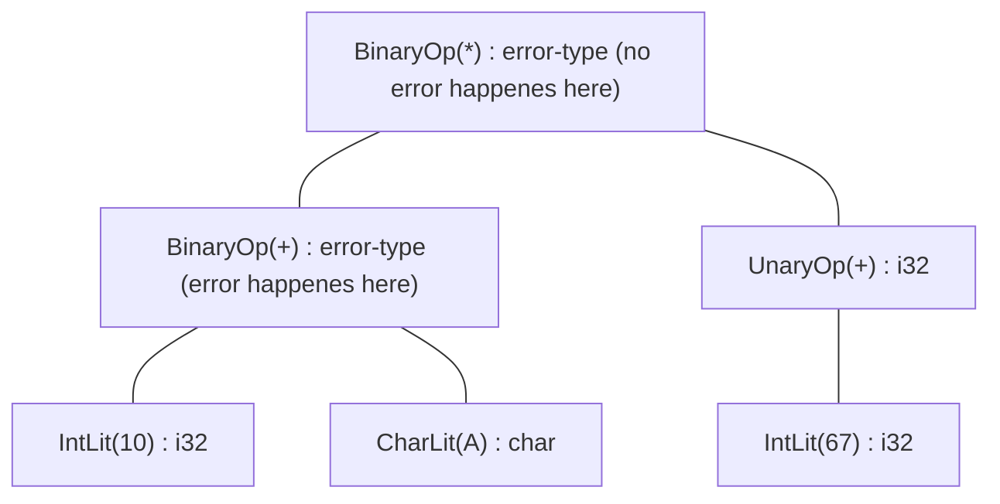

# Type Checking

The `TypeChecker` implements the interface of a `Visitor`. Its Job is to make
sure, all types in the `AST` are filled and correct. Right now we make some
assumptions on what types can be assigned and combined, these assumptions are mostly temporary and will very likely all change:

- All `BinaryExpr` nodes can operate on two expressions that are any `PrimitiveType`
- All `UnaryExpr` nodes can operate on a one expression that is any `PrimitiveType`
- Functions are only usable after they have been declared, there is no hoisting

## Type Errors

The `TypeChecker` is written in a way where a type error will not just abort the whole type checking pass. We do this, so we can get as much error diagnostics as possible by just compiling the source code one time. When a type error happened, we will add a message inside the `TypeChecker` internally. The node that produces the error will then have the type `ErrorType`. Type errors can occur if one of the following happenes:

- A `BinaryExpr` or a `UnaryExpr` is called on invalid types
- A `VarRef` referes to a symbol that is not defined
- A `FuncCall` is called on a symbol that is not defined or on a Symbol that is not a `FunctionType`

When a type error happenes we will propagate the `ErrorType` inside the nodes type upwards in the expression tree. The actual error only happened at one place, the propagation of the `ErrorType` will not repeatedly add to the internal `TypeChecker` error messages. Here is a small, basic example on how this could look like:

